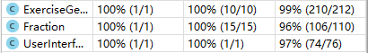
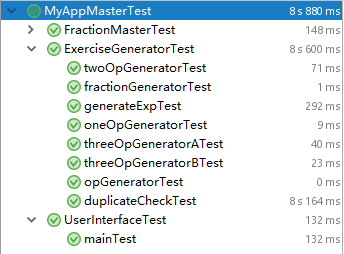

# 四则运算

[GitHub仓库](https://github.com/EdwardLiu-Aurora/MyApp)

## 功能实现

- [x] 使用 -n 参数控制生成题目的个数，并且根据解空间限制用户设定的范围(如 range == 2 时，用户却要求生成 10000 道题目，这明显不合理)
- [x] 使用 -r 参数控制题目中**自然数、真分数、真分数分母的范围** 该参数可以设置为**大于 2 的自然数**
- [x] 生成的题目在计算过程不能产生负数
- [x] 生成的题目中如果存在形如e<sub>1</sub> ÷ e<sub>2</sub>的子表达式，那么其结果应是**真分数**
- [x] 程序一次运行生成的题目**不能重复**，生成的题目存入执行程序目录下的**Exercises.txt**文件中
- [x] 每道题目中出现的运算符个数不超过3个(不包括括号)
- [x] 在生成题目的同时，计算出所有题目的答案，并存入执行程序的当前目录下的**Answers.txt**文件
- [x] 程序应能支持一万道题目的生成。
- [x] 程序支持对给定的题目文件和答案文件，判定答案中的对错并进行数量统计。

## 设计过程

### 表达式的生成

根据题目的要求，表达式中运算符不能超过 3 个，因此所生成的表达式种类可以归纳为以下四类：

- 单算子表达式
    - 型如 A ? B 的表达式
    - 在生成表达式时在** + × **这种拥有交换律的符号时，默认按照查重式 A < B 的顺序排序查重即可
- 双算子表达式 
    - 型如 (A ? B) ? C 的表达式
    - 在生成表达式时只要保证括号内的符号满足交换律时，默认按照查重式 A < B 的顺序排序查重即可
- 三算子 A 型表达式
    - 型如 ((A ? B) ? C) ? D) 的表达式
    - 在生成表达式时，查重规则和双算子表达式一样，只需要保持查重式中 A < B 而无需顾虑 C 和 D，因为根据题目定义 ((A ? B) ? C) ? D) 和 ((A ? B) ? D) ? C) 是两道不同的题目
- 三算子 B 型表达式
    - 型如 (A ? B) ? (C ? D) 的表达式
    - 在生成表达式时，保证查重式 A < B 且 C < D 且 A < C 即可。


> 上述表达中有几点需要解释：
>
> 查重式：在生成四则运算题目时，为了检查题目重复而对题目书写进行了特定排序的表达式。该表达式语义和实际题目是一样的，而只为查重服务，可能不会出现在最终的题目里。例如 1 + 2 就是 2 + 1 的查重式，(1 + 3) + (2 + 4) 是 (4 + 2) + (3 + 1) 的查重式
>
> 偷懒的写法：因为实际上，长的表达式中包含了短的表达式，我们只需要写好**单算子表达式**和**双算子表达式**，后面的表达式生成函数就可以直接套用前面两个生成器的模式，而减少了很多重复劳动。即如双算子表达式里的(A ? B)部分可以依靠单算子表达式生成器进行生成。

### 负数的避免

负数只会在减法运算时产生，每当遇到减法运算时，只需要检查位于左侧的表达式或分数大于等于位于右侧的即可。否则，交换减法运算的左右操作数。

### 除法假分数的避免

除法假分数只会在位于右侧的操作数大于位于左侧的操作数时产生，只需要检查位于左侧的表达式小于或等于右侧的即可。否则，交换除法运算的左右操作数。

### 操作数的表示

无论是真假分数还是整数，都可以当成分数来进行计算。在生成操作数的时候，我们就会使用一个分数生成器，按照特定规则，生成分数。而表达式的操作也是分数和分数之间的操作。直到最后生成表达式时，才会将分数进行转化输出。

### 判断是否重复

因为查重式子能确保所有同义的运算式都能输出为同一个算式，所以可以直接将查重式放进 HashSet 中，一旦查询到一个查重式已经存在于 HashSet 中，则证明这个式子已经重复。否则则没有重复。

## 代码

### 分数类 Fraction

实现了分数的存储、加减乘除基本运算、化简、和字符串的相互转化以及字符串算术式的计算等功能

```java
import java.util.Stack;

/**
 * 分数类
 */
public class Fraction {
    /**
     * 带分数的分子
     */
    private int numerator = 0;
    /**
     * 带分数的分母
     */
    private int denominator = 1;
    /**
     * 符号位（1表示整数，-1表示负数）
     */
    private int symbol = 1;

    public Fraction() {
    }

    public Fraction(int numerator, int denominator) {
        if (denominator == 0) throw new ArithmeticException("分母不能为 0 ");
        this.symbol = numerator * denominator < 0 ? -1 : 1;
        this.numerator = Math.abs(numerator);
        this.denominator = Math.abs(denominator);
        this.simplify();
    }

    /**
     * 求两个数的最大公因数
     *
     * @param numberA 数A
     * @param numberB 数B
     * @return 返回最大公因数
     */
    private static int gcd(int numberA, int numberB) {
        if (numberA % numberB == 0) {
            return numberB;
        } else {
            return gcd(numberB, numberA % numberB);
        }
    }

    /**
     * 求两个数的最小公倍数
     *
     * @param numberA 数A
     * @param numberB 数B
     * @return 返回最小公倍数
     */
    private static int lcm(int numberA, int numberB) {
        return numberA * numberB / gcd(numberA, numberB);
    }

    /**
     * 将分数进行化简
     */
    private void simplify() {
        int div = gcd(numerator, denominator);
        if(div != 1) {
            numerator /= div;
            denominator /= div;
        }
    }

    /**
     * 分数加法
     *
     * @param fraction 加数
     * @return 返回分数类型结果
     * 结果为真分数
     */
    public Fraction add(Fraction fraction) {
        // 先获取两个分数分母的最小公倍数
        int mul = lcm(this.denominator, fraction.denominator);
        int numerator = this.symbol * this.numerator * mul / this.denominator
                + fraction.symbol * fraction.numerator * mul / fraction.denominator;
        return new Fraction(numerator, mul);
    }

    /**
     * 分数减法
     *
     * @param fraction 减数
     * @return 返回分数类型结果
     * 结果为真分数
     */
    public Fraction subtract(Fraction fraction) {
        //先获取两个分数分母的最小公倍数
        int mul = lcm(this.denominator, fraction.denominator);
        int numerator = this.symbol * this.numerator * mul / this.denominator
                - fraction.symbol * fraction.numerator * mul / fraction.denominator;
        return new Fraction(numerator, mul);
    }

    /**
     * 分数乘法
     *
     * @param fraction 乘数
     * @return 返回分数类型结果
     * 这里的结果可能不为真分数
     */
    public Fraction multiply(Fraction fraction) {
        //这里只需要随便一个数表示符号
        return new Fraction(this.numerator * fraction.numerator,
                this.symbol * fraction.symbol * this.denominator * fraction.denominator);
    }

    /**
     * 分数除法
     *
     * @param fraction 除数
     * @return 返回分数类型结果
     * 这里的结果可能不为真分数
     */
    public Fraction divide(Fraction fraction) {
        if (fraction.numerator == 0)
            throw new ArithmeticException("除数不能为 0 ");
        Fraction f = new Fraction(fraction.denominator, fraction.numerator);
        return this.multiply(f);
    }

    /**
     * 判断该分数是否比输入分数大
     * @param fraction 输入分数
     * @return true 为大, false 为小于等于
     */
    public boolean isGreaterThan(Fraction fraction) {
        Fraction result = subtract(fraction);
        if(result.symbol == -1) return false;
        else if(result.numerator == 0) return false;
        return true;
    }

    @Override
    public String toString() {
        StringBuilder fraction = new StringBuilder();
        //先处理符号问题
        if (symbol == -1)
            fraction.append("-");
        if (numerator == 0) {
            fraction.append("0");
        } else if (numerator > denominator) {
            //如果分子比分母大，化为真分数
            fraction.append(numerator / denominator);
            if (numerator % denominator != 0) {
                fraction.append("'");
                fraction.append(numerator % denominator);
                fraction.append("/");
                fraction.append(denominator);
            }
        } else if (numerator < denominator) {
            fraction.append(numerator);
            fraction.append("/");
            fraction.append(denominator);
        } else {
            fraction.append(1);
        }
        return fraction.toString();
    }

    /**
     * 将String转化为Fraction
     *
     * @param s String
     * @return Fraction分数
     */
    public static Fraction string2Fraction(String s) {
        int numerator = 0;
        int denominator = 1;
        //这里取'之后的字符串进行操作
        String[] strings = s.substring(s.indexOf("'") + 1).split("/");
        if (strings.length <= 0) throw new NumberFormatException();
        numerator = Integer.parseInt(strings[0]);
        if (strings.length >= 2) denominator = Integer.parseInt(strings[1]);
        //操作'之前的
        if (s.contains("'")) numerator = Integer.parseInt(s.substring(0, s.indexOf("'"))) * denominator + numerator;
        return new Fraction(numerator, denominator);
    }

    /**
     * 计算字符串四则运算式的函数
     * @param sIn String 表示的四则运算式
     * @return 该四则运算式的答案
     */
    public static Fraction calculateStringExp(String sIn) {
        Stack<Fraction> fractionStack = new Stack<>();
        Stack<Character> symbolStack = new Stack<>();
        String s = sIn.replaceAll(" ","");
        s += "=";
        StringBuffer temp = new StringBuffer();
        for(int i = 0; i < s.length();i++) {
            char ch = s.charAt(i);
            if((ch >= '0' && ch <= '9') || ch == '\'' || ch == '/')
                temp.append(ch);
            else {
                String tempStr = temp.toString();
                if(!tempStr.isEmpty()) {
                    Fraction f = Fraction.string2Fraction(tempStr);
                    fractionStack.push(f);
                    temp = new StringBuffer();
                }
                while(!comparePriority(ch, symbolStack) && !symbolStack.empty()) {
                    Fraction numberB = fractionStack.pop();
                    Fraction numberA = fractionStack.pop();
                    switch(symbolStack.pop()) {
                        case '+':
                            fractionStack.push(numberA.add(numberB));
                            break;
                        case '-':
                            fractionStack.push(numberA.subtract(numberB));
                            break;
                        case '×':
                            fractionStack.push(numberA.multiply(numberB));
                            break;
                        case '÷':
                            fractionStack.push(numberA.divide(numberB));
                            break;
                        default:
                            break;
                    }
                }
                if(ch != '=') {
                    symbolStack.push(ch);
                    if (ch == ')') {
                        symbolStack.pop();
                        symbolStack.pop();
                    }
                }
            }
        }
        return fractionStack.pop();
    }

    /**
     * 判定符号优先级的类
     * @param symbol 符号
     * @param symbolStack 符号栈
     * @return
     */
    private static boolean comparePriority(char symbol, Stack<Character> symbolStack) {
        if (symbolStack.empty()) return true;
        // 符号优先级说明（从高到低）: ( 大于 × ÷ 大于 + - 大于 )
        char top = symbolStack.peek();
        if (top == '(') return true;
        switch (symbol) {
            case '(': return true;
            case '×':
                if (top == '+' || top == '-') return true;
                else return false;
            case '÷':
                if (top == '+' || top == '-') return true;
                else return false;
            case '+': return false;
            case '-': return false;
            case ')': return false;
            case '=': return false;
            default: break;
        }
        return true;
    }

    /**
     * 判断这个分数值是否为 0
     * @return
     */
    public boolean isZero() {
        return numerator == 0;
    }

}
```

### ExerciseGenerator 算术式生成器

定义了各类负责随机生成的函数
- 随机生成分数
- 随机生成符号
- 随机生成单算子表达式
- 随机生成二算子表达式
- 随机生成三算子 A 型表达式
- 随机生成三算子 B 型表达式
- 查重式的查重
- 最终表达式和答案的输出

```java
import java.util.*;

// 算数题目生成
public class ExerciseGenerator {
    /**
     * 数值范围
     */
    private int range;
    /**
     * 题目数量
     */
    private int number;
    /**
     * 随机数种子，用于生成各种随机选项
     */
    private Random random = new Random(System.currentTimeMillis());
    /**
     * 验证重复使用的哈希集合
     */
    private Set<String> duplicateCheckSet = new HashSet<>();
    /**
     * 存储答案使用的哈希映射表 <算式, 答案>
     */
    private HashMap<String, String> resultMap = new HashMap<>();

    public ExerciseGenerator(){}
    public ExerciseGenerator(int range, int number){
        if(range < 2) throw new IllegalArgumentException("数值的范围不能小于 2 ");
        if(number < 1) throw new IllegalArgumentException("题目的数量不能小于 1 ");
        this.range = range;
        this.number = number;
    }

    /**
     * 生成算术式和答案的类
     * @return 当对应 range 可以生成 number 个算术式时，返回表达式和答案；否则返回 null
     */
    public HashMap<String,String> generateExp() {
        if(number > 1000*(range-1)*(range-1)) return null;
        duplicateCheckSet = new HashSet<>();
        resultMap = new HashMap<>();
        int allo = 0;
        String[] answer;
        while(duplicateCheckSet.size() < number) {
            allo = random.nextInt(101);
            if(allo <= 1) answer = oneOpGenerator();
            else if(allo <= 10) answer = twoOpGenerator();
            else if(allo <= 55) answer = threeOpGeneratorA();
            else answer = threeOpGeneratorB();
            if(duplicateCheck(answer[0])) resultMap.put(answer[1], answer[2]);
        }
        return resultMap;
    }

    public boolean duplicateCheck(String expression) {
        if(duplicateCheckSet.contains(expression)) return false;
        duplicateCheckSet.add(expression);
        return true;
    }

    /**
     * 数值生成器
     *
     * @return 分数对象
     */
    public Fraction fractionGenerator() {
        if(range < 1) throw new IllegalArgumentException("数值的范围不能小于 1 ");
        // 分母范围为 1 - range, 不包含 range
        int denominator = random.nextInt(range - 1) + 1;
        int numerator = 0;
        // 分子范围为 0 - range ^ 2, 不包含 range ^ 2
        numerator = random.nextInt(denominator * denominator + 1);
        return new Fraction(numerator, denominator);
    }

    /**
     * 算子生成器
     * @return + - × ÷ 中的任一一个运算符
     */
    public char opGenerator() {
        char result;
        switch(random.nextInt(4)) {
            case 0:
                result = '+';
                break;
            case 1:
                result = '-';
                break;
            case 2:
                result = '×';
                break;
            case 3:
                result = '÷';
                break;
            default:
                result = '+';
        }
        return result;
    }

    /**
     * 单算子算术式生成器
     * @return 字符串数组，[0]放置化简的查重字符串，[1]放置混淆后的实际字符串，[2]放置算术式答案，[3]放置本次算术式生成的运算符
     */
    public String[] oneOpGenerator() {
        String[] result = new String[4];
        Fraction numberA = fractionGenerator();
        Fraction numberB = fractionGenerator();
        switch(opGenerator()) {
            case '-':
                result[3] = "-";
                // 将大的数放在前面
                if(!numberA.isGreaterThan(numberB)) {
                    Fraction temp = numberA;
                    numberA = numberB;
                    numberB = temp;
                }
                // 对于减法的情况，化简的查重字符串和混淆字符串是一样的
                result[0] = numberA.toString() + " - " + numberB.toString();
                result[1] = numberA.toString() + " - " + numberB.toString();
                result[2] = numberA.subtract(numberB).toString();
                break;
            case '÷':
                result[3] = "÷";
                // 保证除法分母不为 0
                while(numberB.isZero() || numberA.isGreaterThan(numberB))
                    numberB = fractionGenerator();
                // 对于减法的情况，化简的查重字符串和混淆字符串是一样的
                result[0] = numberA.toString() + " ÷ " + numberB.toString();
                result[1] = numberA.toString() + " ÷ " + numberB.toString();
                result[2] = numberA.divide(numberB).toString();
                break;
            case '+':
                result[3] = "+";
                // 对于加法的情况，查重字符串要把数从小到大排，而混淆字符串则不需要
                if(numberA.isGreaterThan(numberB)) result[0] = numberB.toString() + " + " + numberA.toString();
                else result[0] = numberA.toString() + " + " + numberB.toString();
                result[1] = numberA.toString() + " + " + numberB.toString();
                result[2] = numberA.add(numberB).toString();
                break;
            case '×':
                result[3] = "×";
                // 对于乘法的情况，查重字符串要把数从小到大排，而混淆字符串则不需要
                if(numberA.isGreaterThan(numberB)) result[0] = numberB.toString() + " × " + numberA.toString();
                else result[0] = numberA.toString() + " × " + numberB.toString();
                result[1] = numberA.toString() + " × " + numberB.toString();
                result[2] = numberA.multiply(numberB).toString();
                break;
        }
        return result;
    }

    /**
     * 二算子算术式生成器
     * @return 字符串数组，[0]放置化简的查重字符串，[1]放置混淆后的实际字符串，[2]放置算术式答案，[3]放置本次算术式生成的运算符
     */
    public String[] twoOpGenerator() {
        // 生成一个单算子算术式
        String[] result = oneOpGenerator();
        Fraction numberA = Fraction.string2Fraction(result[2]);
        Fraction numberB = fractionGenerator();
        switch(opGenerator()){
            case '+':
                result[0] = result[0] + " + " + numberB.toString();
                result[2] = numberA.add(numberB).toString();
                // 随机决定是否扰乱次序
                if(random.nextInt(2) == 0) {
                    // 不扰乱次序
                    result[1] = result[1] + " + " + numberB.toString();
                }
                else {
                    // 扰乱次序要检查符号优先级，如果优先级大，则不需要加括号
                    if(result[3].equals("×") || result[3].equals("÷")) result[1] = numberB.toString() + " + " + result[1];
                    else result[1] = numberB.toString() + " + (" + result[1] + ")";
                }
                result[3] = "+";
                break;
            case '-':
                // 如果前面的数比后面的数小，则需要调换顺序
                if(!numberA.isGreaterThan(numberB)) {
                    // 如果原本表达式符号优先级高，则不需要加括号
                    if(result[3].equals("×") || result[3].equals("÷")){
                        result[0] = numberB.toString() + " - " + result[0];
                        result[1] = numberB.toString() + " - " + result[1];
                        result[2] = numberB.subtract(numberA).toString();
                    }
                    // 如果原本表达式的优先级和当前的相同，则需要加括号
                    else {
                        result[0] = numberB.toString() + " - (" + result[0] + ")";
                        result[1] = numberB.toString() + " - (" + result[1] + ")";
                        result[2] = numberB.subtract(numberA).toString();
                    }
                } else {
                    result[0] = result[0] + " - " + numberB.toString();
                    result[1] = result[1] + " - " + numberB.toString();
                    result[2] = numberA.subtract(numberB).toString();
                }
                result[3] = "-";
                break;
            case '×':
                // 如果原算术式优先级和 × 相等，则不需要加括号
                if(result[3].equals("×") || result[3].equals("÷")) result[0] = result[0] + " × " + numberB.toString();
                else result[0] = "(" + result[0] + ") × " + numberB.toString();
                result[2] = numberA.multiply(numberB).toString();
                // 随机决定是否扰乱次序
                if(random.nextInt(2) == 0) {
                    // 如果遇到加减要加括号
                    if(result[3].equals("×") || result[3].equals("÷")) result[1] = result[1] + " × " + numberB.toString();
                    else result[1] = "(" + result[1] + ") × " + numberB.toString();
                }
                else {
                    // 因为 × 的优先级大，所以扰乱次序在任何情况下都要加括号
                    result[1] = numberB.toString() + " × (" + result[1] + ")";
                }
                result[3] = "×";
                break;
            case '÷':
                while(numberB.isZero())
                    numberB = fractionGenerator();
                // 如果之前的算术式结果为 0，则必须调换位置；后面的随机数决定在符合条件的时候是否更换次序以加大题目随机性
                if(numberA.isZero() || numberB.isGreaterThan(numberA) || random.nextInt(2) == 0) {
                    // 如果原来的式子优先级低
                    if(result[3].equals("+") || result[3].equals("-")) {
                        result[0] = "(" + result[0] + ") ÷ " + numberB.toString();
                        result[1] = "(" + result[1] + ") ÷ " + numberB.toString();
                        result[2] = numberA.divide(numberB).toString();
                    }
                    else {
                        result[0] = result[0] + " ÷ " + numberB.toString();
                        result[1] = result[1] + " ÷ " + numberB.toString();
                        result[2] = numberA.divide(numberB).toString();
                    }
                } else {
                    // 如果更换次序，则无论如何都必须加括号
                    result[0] = numberB.toString() + " ÷ (" + result[0] + ")";
                    result[1] = numberB.toString() + " ÷ (" + result[1] + ")";
                    result[2] = numberB.divide(numberA).toString();
                }
                result[3] = "÷";
                break;
        }
        return result;
    }

    /**
     * 三算子算术式生成器 - A型（3+1）
     * @return 字符串数组，[0]放置化简的查重字符串，[1]放置混淆后的实际字符串，[2]放置算术式答案，[3]放置本次算术式生成的运算符
     */
    public String[] threeOpGeneratorA() {
        // 生成一个双算子算术式
        String[] result = twoOpGenerator();
        Fraction numberA = Fraction.string2Fraction(result[2]);
        Fraction numberB = fractionGenerator();
        switch(opGenerator()){
            case '+':
                result[0] = result[0] + " + " + numberB.toString();
                result[2] = numberA.add(numberB).toString();
                // 随机决定是否扰乱次序
                if(random.nextInt(2) == 0) {
                    // 不扰乱次序
                    result[1] = result[1] + " + " + numberB.toString();
                }
                else {
                    // 扰乱次序要检查符号优先级，如果优先级大，则不需要加括号
                    if(result[3].equals("×") || result[3].equals("÷")) result[1] = numberB.toString() + " + " + result[1];
                    else result[1] = numberB.toString() + " + (" + result[1] + ")";
                }
                result[3] = "+";
                break;
            case '-':
                // 如果前面的数比后面的数小，则需要调换顺序
                if(!numberA.isGreaterThan(numberB)) {
                    // 如果原本表达式符号优先级高，则不需要加括号
                    if(result[3].equals("×") || result[3].equals("÷")){
                        result[0] = numberB.toString() + " - " + result[0];
                        result[1] = numberB.toString() + " - " + result[1];
                        result[2] = numberB.subtract(numberA).toString();
                    }
                    // 如果原本表达式的优先级和当前的相同，则需要加括号
                    else {
                        result[0] = numberB.toString() + " - (" + result[0] + ")";
                        result[1] = numberB.toString() + " - (" + result[1] + ")";
                        result[2] = numberB.subtract(numberA).toString();
                    }
                } else {
                    result[0] = result[0] + " - " + numberB.toString();
                    result[1] = result[1] + " - " + numberB.toString();
                    result[2] = numberA.subtract(numberB).toString();
                }
                result[3] = "-";
                break;
            case '×':
                // 如果原算术式优先级和 × 相等，则不需要加括号
                if(result[3].equals("×") || result[3].equals("÷")) result[0] = result[0] + " × " + numberB.toString();
                else result[0] = "(" + result[0] + ") × " + numberB.toString();
                result[2] = numberA.multiply(numberB).toString();
                // 随机决定是否扰乱次序
                if(random.nextInt(2) == 0) {
                    // 如果遇到加减要加括号
                    if(result[3].equals("×") || result[3].equals("÷")) result[1] = result[1] + " × " + numberB.toString();
                    else result[1] = "(" + result[1] + ") × " + numberB.toString();
                }
                else {
                    // 因为 × 的优先级大，所以扰乱次序在任何情况下都要加括号
                    result[1] = numberB.toString() + " × (" + result[1] + ")";
                }
                result[3] = "×";
                break;
            case '÷':
                while(numberB.isZero())
                    numberB = fractionGenerator();
                // 如果之前的算术式结果为 0，则必须调换位置；后面的随机数决定在符合条件的时候是否更换次序以加大题目随机性
                if(numberA.isZero() || numberB.isGreaterThan(numberA) || random.nextInt(2) == 0) {
                    // 如果原来的式子优先级低
                    if(result[3].equals("+") || result[3].equals("-")) {
                        result[0] = "(" + result[0] + ") ÷ " + numberB.toString();
                        result[1] = "(" + result[1] + ") ÷ " + numberB.toString();
                        result[2] = numberA.divide(numberB).toString();
                    }
                    else {
                        result[0] = result[0] + " ÷ " + numberB.toString();
                        result[1] = result[1] + " ÷ " + numberB.toString();
                        result[2] = numberA.divide(numberB).toString();
                    }
                } else {
                    // 如果更换次序，则无论如何都必须加括号
                    result[0] = numberB.toString() + " ÷ (" + result[0] + ")";
                    result[1] = numberB.toString() + " ÷ (" + result[1] + ")";
                    result[2] = numberB.divide(numberA).toString();
                }
                result[3] = "÷";
                break;
        }
        return result;
    }

    /**
     * 三算子算术式生成器 - B型（2+2）
     * @return 字符串数组，[0]放置化简后的字符串，[1]放置化简前的字符串，[2]放置算术式答案
     */
    public String[] threeOpGeneratorB() {
        String[] result = new String[4];
        String[] expA = oneOpGenerator();
        String[] expB = oneOpGenerator();
        Fraction aheadA = Fraction.string2Fraction(expA[0].substring(0, expA[0].indexOf(" ")));
        Fraction aheadB = Fraction.string2Fraction(expB[0].substring(0, expB[0].indexOf(" ")));
        if(aheadA.isGreaterThan(aheadB)) {
            String[] temp = expA;
            expA = expB;
            expB = temp;
        }
        Fraction numberA = Fraction.string2Fraction(expA[2]);
        Fraction numberB = Fraction.string2Fraction(expB[2]);
        switch(opGenerator()) {
            case '-':
                // 将大的数放在前面
                if(!numberA.isGreaterThan(numberB)) {
                    result[0] = "(" + expB[0] + ")" + " - " + "(" + expA[0] + ")";
                    result[1] = "(" + expB[1] + ")" + " - " + "(" + expA[1] + ")";
                    result[2] = numberB.subtract(numberA).toString();
                }else {
                    // 对于减法的情况，化简的查重字符串和混淆字符串是一样的
                    result[0] = "(" + expA[0] + ")" + " - " + "(" + expB[0] + ")";
                    result[1] = "(" + expA[1] + ")" + " - " + "(" + expB[1] + ")";
                    result[2] = numberA.subtract(numberB).toString();
                }
                result[3] = "-";
                break;
            case '÷':
                // 保证除法分母不为 0
                while(numberB.isZero() || numberA.isGreaterThan(numberB)){
                    expB = oneOpGenerator();
                    numberB = Fraction.string2Fraction(expB[2]);
                }
                // 对于减法的情况，化简的查重字符串和混淆字符串是一样的
                result[0] = "(" + expA[0] + ")" + " ÷ " + "(" + expB[0] + ")";
                result[1] = "(" + expA[1] + ")" + " ÷ " + "(" + expB[1] + ")";
                result[2] = numberA.divide(numberB).toString();
                result[3] = "÷";
                break;
            case '+':
                // 对于加法的情况，查重字符串要把数从小到大排，而混淆字符串则不需要
                if(numberA.isGreaterThan(numberB)) result[0] = "(" + expB[0] + ")" + " + " + "(" + expA[0] + ")";
                else result[0] = "(" + expA[0] + ")" + " + " + "(" + expB[0] + ")";
                result[1] = "(" + expA[1] + ")" + " + " + "(" + expB[1] + ")";
                result[2] = numberA.add(numberB).toString();
                result[3] = "+";
                break;
            case '×':
                // 对于乘法的情况，查重字符串要把数从小到大排，而混淆字符串则不需要
                if(numberA.isGreaterThan(numberB)) result[0] = "(" + expB[0] + ")" + " × " + "(" + expA[0] + ")";
                else result[0] = "(" + expA[0] + ")" + " × " + "(" + expB[0] + ")";
                result[1] = "(" + expA[1] + ")" + " × " + "(" + expB[1] + ")";
                result[2] = numberA.multiply(numberB).toString();
                result[3] = "×";
                break;
        }
        return result;
    }
}
```

### UserInterface 用户接口类

负责进行题目的生成和作业的批改

```java
import java.beans.Transient;
import java.io.*;
import java.util.HashMap;
import java.util.Map;

public class UserInterface {
    public static void mainTest(String args[]) {
        int number = 0;
        int range = 0;
        String exercise = null;
        String answer = null;
        for (int i = 0; i < args.length; i++) {
            if (args[i].equals("-n")) number = Integer.valueOf(args[++i]);
            if (args[i].equals("-r")) range = Integer.valueOf(args[++i]);
            if (args[i].equals("-e")) exercise = args[++i];
            if (args[i].equals("-a")) answer = args[++i];
        }
        if (number > 0 && range > 1) {
            ExerciseGenerator exGen = new ExerciseGenerator(range, number);
            HashMap<String, String> result = exGen.generateExp();
            File exerciseFile = new File("Exercises.txt");
            File answerFile = new File("Answers.txt");
            FileWriter exerciseFileFW = null;
            FileWriter answerFileFW = null;
            try {
                exerciseFileFW = new FileWriter(exerciseFile);
                answerFileFW = new FileWriter(answerFile);
                if (result != null) {
                    int i = 1;
                    for (Map.Entry<String, String> entry : result.entrySet()) {
                        exerciseFileFW.append(i + ". " + entry.getKey() + "\r\n");
                        answerFileFW.append(i + ". " + entry.getValue() + "\r\n");
                        i++;
                        exerciseFileFW.flush();
                        answerFileFW.flush();
                    }
                    System.out.println("完成出题。");
                } else {
                    System.out.println("请减小出题数量或者增大数值范围。");
                }
            } catch (IOException e) {
                System.out.println("请检查该目录是否可写。");
            }
        }
        if (exercise != null && answer != null) {
            StringBuilder correct = new StringBuilder("");
            StringBuilder wrong = new StringBuilder("");
            int correctInt = 0;
            int wrongInt = 0;
            File exercises = new File(exercise);
            File answers = new File(answer);
            File grades = new File("Grade.txt");
            BufferedReader exercisesReader = null;
            BufferedReader answersReader = null;
            String e = null;
            String a = null;
            String t = null;
            try {
                exercisesReader = new BufferedReader(new FileReader(exercises));
                answersReader = new BufferedReader(new FileReader(answers));
                while((e=exercisesReader.readLine())!=null){
                    a = answersReader.readLine();
                    t = e.substring(0, e.indexOf("."));
                    if(Fraction.calculateStringExp(e.substring(e.indexOf(" ") + 1))
                            .toString()
                            .equals(a.substring(a.indexOf(" ") + 1))) {
                        correct.append(t).append(",");
                        correctInt++;
                    }
                    else {
                        wrong.append(t).append(",");
                        wrongInt++;
                    }
                }
                if(correct.length()>0) correct.deleteCharAt(correct.length()-1);
                if(wrong.length()>0) wrong.deleteCharAt(wrong.length()-1);
                FileWriter gradesFW = new FileWriter(grades);
                gradesFW.append("Correct: ");
                gradesFW.append(correctInt + "(");
                gradesFW.append(correct.toString() + ")");
                gradesFW.append("\r\n");
                gradesFW.flush();
                gradesFW.append("Wrong: ");
                gradesFW.append(wrongInt + "(");
                gradesFW.append(wrong.toString() + ")");
                gradesFW.append("\r\n");
                gradesFW.flush();
            }
            catch(Exception ex){
                System.out.println("批改程序出错，请检查输入的文件名是否正确。");
            }
            System.out.println("完成批改。");
        }
    }
}
```

## 测试

本项目所有测试都使用 Junit 进行，测试覆盖了所有的方法。

### FractionS2FTest 测试字符串<->分数互换功能

```java
import org.junit.Test;
import org.junit.runner.RunWith;
import org.junit.runners.Parameterized;

import java.util.Arrays;
import java.util.Collection;

import static org.junit.Assert.assertEquals;

@RunWith(value=Parameterized.class)
public class FractionS2FTest {
    private String input;
    private String output;

    @Parameterized.Parameters
    public static Collection data() {
        return Arrays.asList(new Object[][] {
                {"0","0"},
                {"1/4","1/4"},
                {"2/4","1/2"},
                {"3/4","3/4"},
                {"4/4","1"},
                {"5/4","1'1/4"},
                {"6/4","1'1/2"},
                {"7/4","1'3/4"},
                {"8/4","2"},
                {"9/4","2'1/4"},
                {"10/4","2'1/2"},
                {"11/4","2'3/4"},
                {"12/4","3"},
                {"13/4","3'1/4"},
                {"14/4","3'1/2"},
                {"15/4","3'3/4"}
        });
    }

    public FractionS2FTest(String input, String output) {
        this.input = input;
        this.output = output;
    }

    @Test
    public void test() {
        System.out.println("Input: " + input + " Output: " + output);
        assertEquals(Fraction.string2Fraction(input).toString(), output);
        assertEquals(Fraction.string2Fraction(output).toString(), output);
    }
}
```

### FractionConstructorTest 测试分数构造函数和化简功能

```java
import org.junit.Test;
import org.junit.runner.RunWith;
import org.junit.runners.Parameterized;

import java.util.Arrays;
import java.util.Collection;

import static org.junit.Assert.assertEquals;

@RunWith(value=Parameterized.class)
public class FractionConstructorTest {
    private String expected;
    private int numerator;
    private int denominator;

    @Parameterized.Parameters
    public static Collection data() {
        return Arrays.asList(new Object[][] {
                {0,4,"0"},
                {1,4,"1/4"},
                {2,4,"1/2"},
                {3,4,"3/4"},
                {4,4,"1"},
                {5,4,"1'1/4"},
                {6,4,"1'1/2"},
                {7,4,"1'3/4"},
                {8,4,"2"},
                {9,4,"2'1/4"},
                {10,4,"2'1/2"},
                {11,4,"2'3/4"},
                {12,4,"3"},
                {13,4,"3'1/4"},
                {14,4,"3'1/2"},
                {15,4,"3'3/4"}
        });
    }

    public FractionConstructorTest(int numerator, int denominator, String expected) {
        this.expected = expected;
        this.numerator = numerator;
        this.denominator = denominator;
    }

    @Test
    public void test() {
        String result = new Fraction(numerator,denominator).toString();
        System.out.println("The input fraction is: " + numerator + "/" + denominator + " and expression is: " + result);
        assertEquals(expected, result);
    }
}
```

### FractionArithmeticTest 测试分数四则运算和算术式整体运算功能

```java
import org.junit.Test;

import static org.junit.Assert.assertEquals;

public class FractionArithmeticTest {
    @Test
    public void addTest() {
        assertEquals(Fraction.string2Fraction("44/5").toString(), Fraction.string2Fraction("8/1").add(Fraction.string2Fraction("4/5")).toString());
        assertEquals(Fraction.string2Fraction("2/1").toString(), Fraction.string2Fraction("0/4").add(Fraction.string2Fraction("6/3")).toString());
        assertEquals(Fraction.string2Fraction("79/24").toString(), Fraction.string2Fraction("8/3").add(Fraction.string2Fraction("5/8")).toString());
        assertEquals(Fraction.string2Fraction("2/1").toString(), Fraction.string2Fraction("8/6").add(Fraction.string2Fraction("4/6")).toString());
        assertEquals(Fraction.string2Fraction("3/7").toString(), Fraction.string2Fraction("3/7").add(Fraction.string2Fraction("0/5")).toString());
    }

    @Test
    public void subtractTest() {
        assertEquals(Fraction.string2Fraction("47/56").toString(), Fraction.string2Fraction("9/8").subtract(Fraction.string2Fraction("2/7")).toString());
        assertEquals(Fraction.string2Fraction("7/6").toString(), Fraction.string2Fraction("5/3").subtract(Fraction.string2Fraction("1/2")).toString());
        assertEquals(Fraction.string2Fraction("1/1").toString(), Fraction.string2Fraction("2/1").subtract(Fraction.string2Fraction("6/6")).toString());
        assertEquals(Fraction.string2Fraction("1/2").toString(), Fraction.string2Fraction("2/3").subtract(Fraction.string2Fraction("1/6")).toString());
        assertEquals(Fraction.string2Fraction("1/2").toString(), Fraction.string2Fraction("3/6").subtract(Fraction.string2Fraction("0/3")).toString());
    }

    @Test
    public void multiplyTest() {
        assertEquals(Fraction.string2Fraction("0/1").toString(), Fraction.string2Fraction("0/9").multiply(Fraction.string2Fraction("8/4")).toString());
        assertEquals(Fraction.string2Fraction("0/1").toString(), Fraction.string2Fraction("6/5").multiply(Fraction.string2Fraction("0/4")).toString());
        assertEquals(Fraction.string2Fraction("16/63").toString(), Fraction.string2Fraction("4/9").multiply(Fraction.string2Fraction("4/7")).toString());
        assertEquals(Fraction.string2Fraction("7/8").toString(), Fraction.string2Fraction("6/8").multiply(Fraction.string2Fraction("7/6")).toString());
        assertEquals(Fraction.string2Fraction("28/27").toString(), Fraction.string2Fraction("8/9").multiply(Fraction.string2Fraction("7/6")).toString());
    }

    @Test
    public void divideTest() {
        assertEquals(Fraction.string2Fraction("0/1").toString(), Fraction.string2Fraction("0/7").divide(Fraction.string2Fraction("13/4")).toString());
        assertEquals(Fraction.string2Fraction("7/5").toString(), Fraction.string2Fraction("3/5").divide(Fraction.string2Fraction("3/7")).toString());
        assertEquals(Fraction.string2Fraction("12/5").toString(), Fraction.string2Fraction("6/1").divide(Fraction.string2Fraction("5/2")).toString());
        assertEquals(Fraction.string2Fraction("32/9").toString(), Fraction.string2Fraction("8/3").divide(Fraction.string2Fraction("3/4")).toString());
        assertEquals(Fraction.string2Fraction("15/4").toString(), Fraction.string2Fraction("6/8").divide(Fraction.string2Fraction("1/5")).toString());
    }

    @Test
    public void isZeroTest() {
        assertEquals(true, Fraction.string2Fraction("0/4").isZero());
    }

    @Test
    public void isGreaterThanTest() {
        assertEquals(true, Fraction.string2Fraction("5/4").isGreaterThan(Fraction.string2Fraction("1/6")));
        assertEquals(false, Fraction.string2Fraction("1/2").isGreaterThan(Fraction.string2Fraction("1/2")));
        assertEquals(false, Fraction.string2Fraction("2/8").isGreaterThan(Fraction.string2Fraction("3/8")));
    }

    @Test
    public void calculateStringExpTest() {
        assertEquals("60'43/60", Fraction.calculateStringExp("(4/5 + 3'1/4) + (8'8/9 × 6'3/8)").toString());
        assertEquals("0", Fraction.calculateStringExp("(1 × 0) ÷ (6 + 3/8)").toString());
        assertEquals("49'205/294", Fraction.calculateStringExp("2'5/7 × (3'1/2 + (6'1/7 + 8'2/3))").toString());
        assertEquals("5'1/10", Fraction.calculateStringExp("3'2/3 × 3 - 1'1/2 - 4'2/5").toString());
        assertEquals("0", Fraction.calculateStringExp("(4'1/2 - (1/2 + 4)) × 0").toString());
        assertEquals("1", Fraction.calculateStringExp("(5/7 + 1'1/4) - (1'5/7 - 3/4)").toString());
        assertEquals("196/375", Fraction.calculateStringExp("4'1/5 × ((4/5 - 1/3) ÷ 3'3/4)").toString());
        assertEquals("3/7", Fraction.calculateStringExp("(1'3/4 × 1'1/3) ÷ (3'4/9 + 2)").toString());
        assertEquals("15'7/9", Fraction.calculateStringExp("2 × (4'8/9 + 3) - 0").toString());
        assertEquals("23/35", Fraction.calculateStringExp("(1 + 5'4/7) ÷ (4 × 2'1/2)").toString());
        assertEquals("10/107", Fraction.calculateStringExp("1 ÷ (2'3/4 + 2'3/5) × 1/2").toString());
        assertEquals("1'1/42",Fraction.calculateStringExp("2'6/7 - 2'2/3 - 1/6 + 1").toString());
        assertEquals("1'26/35", Fraction.calculateStringExp("(3'3/5 - 1'6/7) - (0 × 1/2)").toString());
        assertEquals("0", Fraction.calculateStringExp("1'1/6 × 5'1/7 × 0 + 0").toString());
        assertEquals("1'17/114", Fraction.calculateStringExp("1'1/5 ÷ 3'4/5 + 4 - 3'1/6").toString());
        assertEquals("44/45", Fraction.calculateStringExp("4'8/9 ÷ 5 × 1 ÷ 1").toString());
        assertEquals("65'1/3", Fraction.calculateStringExp("(5'1/3 + 0) × (4'3/8 × 2'4/5)").toString());
        assertEquals("2'4/7", Fraction.calculateStringExp("2 ÷ 3'1/2 + 2").toString());
        assertEquals("24'17/60", Fraction.calculateStringExp("1'1/5 + 5'2/3 × 3'1/2 + 3'1/4").toString());
        assertEquals("5'7/12", Fraction.calculateStringExp("(4 - 2'1/4) + (4'5/6 - 1)").toString());
    }

}
```

### FractionMasterTest 分数测试汇总类，把上方三个测试归一调用

```java
import org.junit.runner.RunWith;
import org.junit.runners.Suite;

@RunWith(value = Suite.class)
@Suite.SuiteClasses(value={
        FractionArithmeticTest.class,
        FractionConstructorTest.class,
        FractionS2FTest.class})
public class FractionMasterTest {
}
```

### ExerciseGeneratorTest 测试算术式生成类

```java
import org.junit.Test;

import java.util.HashMap;
import java.util.Map;

import static org.junit.Assert.assertFalse;
import static org.junit.Assert.assertTrue;

public class ExerciseGeneratorTest {
    ExerciseGenerator exGen;

    public ExerciseGeneratorTest() {
        exGen = new ExerciseGenerator(10, 1000);
    }

    @Test
    public void fractionGeneratorTest() {
        Fraction f;
        for(int i = 0;i < 100;i++) {
            f = exGen.fractionGenerator();
            assertTrue(Fraction.string2Fraction("10/1").isGreaterThan(f));
            assertFalse(Fraction.string2Fraction("0/1").isGreaterThan(f));
        }
    }

    @Test
    public void opGeneratorTest() {
        int add = 0;
        int sub = 0;
        int mul = 0;
        int div = 0;
        for(int i = 0;i < 100;i++) {
            switch(exGen.opGenerator()){
                case '+': add++; break;
                case '-': sub++; break;
                case '×': mul++; break;
                case '÷': div++; break;
            }
        }
        assertTrue(sub > 0);
        assertTrue(add > 0);
        assertTrue(mul > 0);
        assertTrue(div > 0);
    }

    @Test
    public void oneOpGeneratorTest() {
        String[] ss;
        for(int i = 0;i < 100;i++) {
            ss = exGen.oneOpGenerator();
            for(String s:ss){
                System.out.println(s);
            }
            System.out.println();
        }
    }

    @Test
    public void twoOpGeneratorTest() {
        String[] ss;
        for(int i = 0;i < 100;i++) {
            ss = exGen.twoOpGenerator();
            for(String s:ss){
                System.out.println(s);
            }
            System.out.println();
        }
    }

    @Test
    public void threeOpGeneratorATest() {
        String[] ss;
        for(int i = 0;i < 100;i++) {
            ss = exGen.threeOpGeneratorA();
            for(String s:ss){
                System.out.println(s);
            }
            System.out.println();
        }
    }

    @Test
    public void threeOpGeneratorBTest() {
        String[] ss;
        for(int i = 0;i < 100;i++) {
            ss = exGen.threeOpGeneratorB();
            for(String s:ss){
                System.out.println(s);
            }
            System.out.println();
        }
    }

    @Test
    public void duplicateCheckTest() {
        String[] ss;
        int saveOne = 0;
        int saveTwo = 0;
        int saveThreeA = 0;
        int saveThreeB = 0;
        for(int i = 0;i < 100000;i++) {
            if(i < 1000) {
                ss = exGen.oneOpGenerator();
                if (exGen.duplicateCheck(ss[0])) {
                    System.out.println("这是第 " + (i + 1) + " 个算术式");
                    for (String s : ss) {
                        System.out.println(s);
                    }
                    saveOne++;
                }
            }
            else if(i < 10000){
                ss = exGen.twoOpGenerator();
                if (exGen.duplicateCheck(ss[0])) {
                    System.out.println("这是第 " + (i + 1) + " 个算术式");
                    for (String s : ss) {
                        System.out.println(s);
                    }
                    saveTwo++;
                }
            }
            else if(i < 50000){
                ss = exGen.threeOpGeneratorA();
                if (exGen.duplicateCheck(ss[0])) {
                    System.out.println("这是第 " + (i + 1) + " 个算术式");
                    for (String s : ss) {
                        System.out.println(s);
                    }
                    saveThreeA++;
                }
            }
            else{
                ss = exGen.threeOpGeneratorB();
                if (exGen.duplicateCheck(ss[0])) {
                    System.out.println("这是第 " + (i + 1) + " 个算术式");
                    for (String s : ss) {
                        System.out.println(s);
                    }
                    saveThreeB++;
                }
            }

        }
        System.out.println("一共保留了 " + saveOne + " 个 1 型表达式");
        System.out.println("一共保留了 " + saveTwo + " 个 2 型表达式");
        System.out.println("一共保留了 " + saveThreeA + " 个 3A 型表达式");
        System.out.println("一共保留了 " + saveThreeB + " 个 3B 型表达式");
    }

    @Test
    public void generateExpTest() {
        HashMap<String,String> result = exGen.generateExp();
        if(result != null) {
            System.out.println("最终生成的题目和答案共 " + result.size() + " 对");
            for(Map.Entry<String, String> entry: result.entrySet())
            {
                System.out.println("式子: "+ entry.getKey()+ " 答案: "+entry.getValue());
            }
        }
        else {
            System.out.println("range 和 number 不匹配");
        }
    }
}
```

### UserInterfaceTest 测试用户接口类

```java
import org.junit.Test;

public class UserInterfaceTest {
    @Test
    public void mainTest(){
        UserInterface.mainTest(new String[] {"-r","2","-n","2000"});
        UserInterface.mainTest(new String[] {"-r","1","-n","1"});
        UserInterface.mainTest(new String[] {"-r","10","-n","1000"});
        UserInterface.mainTest(new String[] {"-e","Exercise.txt","-a","Answer.txt"});
        UserInterface.mainTest(new String[] {"-e","ExercisesF.txt","-a","AnswersF.txt"});
    }
}
```

### MyAppMasterTest 软件整体测试，为了检查代码覆盖率

```java
import org.junit.runner.RunWith;
import org.junit.runners.Suite;

@RunWith(value = Suite.class)
@Suite.SuiteClasses(value={
        FractionMasterTest.class,
        ExerciseGeneratorTest.class,
        UserInterfaceTest.class})
public class MyAppMasterTest {
}
```




整体代码覆盖率为** 100% classes, 97% lines **

随机输出 10000 条 10 范围以内的表达式和答案:

[点击我查看10000条表达式](resources/Exercises.txt)

[点击我查看10000条答案](resources/Answers.txt)

批改给定的题目和答案

[点击查看1000道题目的批改结果](resources/Grade.txt)

## PSP

| PSP2.1                                  | Personal Software Process Stages        | 预估耗时（分钟） | 实际耗时（分钟） |
| --------------------------------------- | --------------------------------------- | ---------------- | ---------------- |
| Planning                                | 计划                                    |                  |                  |
| ・ Estimate                              | ・ 估计这个任务需要多少时间              | 30               | 60               |
| Development                             | 开发                                    |                  |                  |
| ・ Analysis                              | ・ 需求分析 (包括学习新技术)             | 45               | 75               |
| ・ Design Spec                           | ・ 生成设计文档                          | 60               | 75               |
| ・ Design Review                         | ・ 设计复审 (和同事审核设计文档)         | 30               | 60               |
| ・ Coding Standard                       | ・ 代码规范 (为目前的开发制定合适的规范) | 30               | 45               |
| ・ Design                                | ・ 具体设计                              | 90               | 120              |
| ・ Coding                                | ・ 具体编码                              | 660              | 900              |
| ・ Code Review                           | ・ 代码复审                              | 60               | 90               |
| ・ Test                                  | ・ 测试（自我测试，修改代码，提交修改）  | 480              | 630              |
| Reporting                               | 报告                                    |                  |                  |
| ・ Test Report                           | ・ 测试报告                              | 45               | 60               |
| ・ Size Measurement                      | ・ 计算工作量                            | 30               | 20               |
| ・ Postmortem & Process Improvement Plan | ・ 事后总结, 并提出过程改进计划          | 45               | 40               |
| 合计                                    |                                         | 1575             | 2175             |

## 总结

与王翠鸾同学一起讨论题目的实现，我主要负责代码的构思和编写，王翠鸾同学主要负责我思路的复审以及部分基础代码的编写。在这个作业里面，王翠鸾同学主要负责了分数类 Fraction 的实现，而我主要负责了表达式生成类 ExerciseGenerator 的实现。结对编程有个好处就是能让我们能相互审阅对方的代码，减少出现错误的几率。同时，两个人商量讨论作业的实现，能让思路更加可靠。本项目中的测试类主要是由我来编写，由于我在上一次的作业中没有过多地关注测试的内容，造成了代码出现了意料之外的bug。这一次，我们对所有的方法使用 junit 进行了单元测试和整体测试，保证了代码覆盖到每一行（除了异常），果然发现了很多隐匿的问题。王翠鸾同学的代码能力还是很扎实的，每次我提出需求，她都能在短时间给我功能完整、注释完善的代码反馈，和她合作的过程也十分愉快。